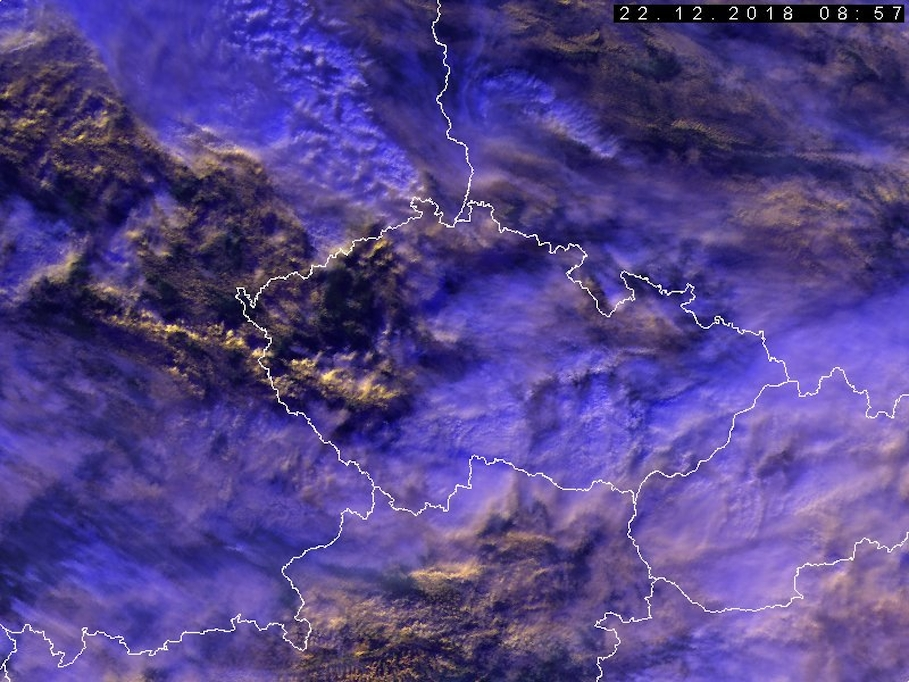
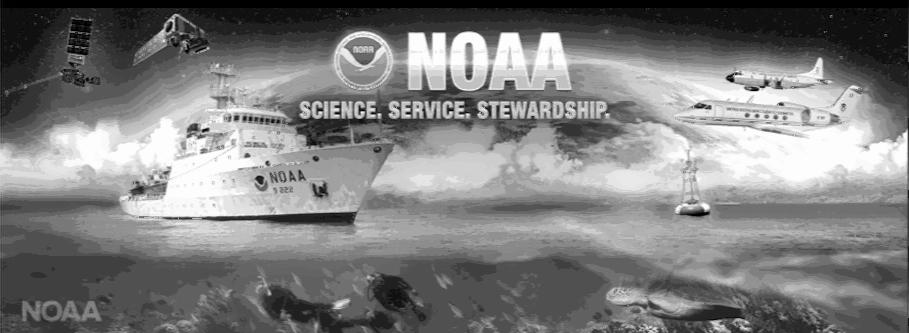

NOAA APT encoder
==================

Load TGA image (24bit, RGB) and encode it to APT (Automatic Picture Transmission) signal.

Information and description:
* https://www.sigidwiki.com/wiki/Automatic_Picture_Transmission_%28APT%29
* https://noaasis.noaa.gov/NOAASIS/pubs/Users_Guide-Building_Receive_Stations_March_2009.pdf


```
NOAA automatic picture transmission (APT) encoder
Usage: Debug/noaa_apt (-i <file> [-s <file>] | -I) [(-d <device> | -O) -m <mode> -lcrM]
  -i <filename> Input TGA image (909px width, 24bit RGB)
  -s <filename> Second input TGA image (B channel, mode ignored)
  -d <device>   OSS audio device (default /dev/dsp) or file
  -m <mode>     Channel B data mode (R,G,B,N,Y,C)
  -I            Read image data from stdin
  -O            Write audio data to stdout
  -M            Multi image reading from stdin
  -l            Enable infinite image loop
  -c            Enable user console
  -r            Device is regular file (write WAV audio file)
  -h            Show this help
                Build: 21:52:59 Aug 18 2019, GCC 5.3.0
```

* Run as: ```guest@porteus:~$ padsp noaa_apt -lci SourceTestImage.tga``` 
* Showing all modes:
  Sync only -> Negative -> Red -> Green -> Blue -> Y -> Negative -> Red -> Green -> Blue -> Y (reload image) -> Negative -> Sync only -> Blue  

<table>
<tr><td>Source image</td><td></td></tr>
<tr><td>Decoded image</td><td></td></tr>
<tr><td>Source audio</td><td><audio src="./doc/SourceTestAudio.ogg" controls preload="none"></audio> <a href="./doc/SourceTestAudio.ogg">Sample</a></td></tr>
</table>

### Special mode C - color

Mode use 12bit (4096 colors, square root of 4096 is 64) look up table. Each color have 4 bit resolution (16 values). Channel A contain Y-pos values and channel B contain X-pos values (position in LUT). Image quality depends on LUT (color position in table). Current LUT is not ideal. Only X-pos is good. For decoding use apt-colorm and for better image quality disable gamma correction in WxToImg.

<table>
<tr><td>Look up table (64x64, upscaled 4x)</td><td></td></tr>
<tr><td>Original image</td><td></td></tr>
<tr><td>Channel A image</td><td></td></tr>
<tr><td>Channel B image</td><td></td></tr>
<tr><td>Decoded color image</td><td></td></tr>
</table>

### TODO

* Add support to ALSA/Portaudio
* Build with CMake

### APT

APT means Automatic Picture Transmission. It is a system, developed in the 1960s, made to transmit low-resolution analog image for weather satellites. A complete APT image takes around 12 minutes to be built up at a rate of 2 lines per second. The data is broadcasted by the satellite. The stream is obtained by the AVHRR/3 instrument. Two channels with a low resolution are emitting all the time using VHF signals at reduced rates (around 120 lines/minutes).
The two channels are composed of : 
 * Channel A: A visible frequency range channel providing APT imagery during the day. 
 * Channel B: An IR channel providing APT imagery at any time of the day and the night. 

#### APT Frame format: 

The broadcasted transmission is made of two channels for the image, synchronization and telemetry information. A complete APT Video Line Time is 2080 pixels long (990 pixels for each image). One APT line is composed of one line for Channel A video followed by one line for Channel B video.
<br>

* Telemetry frame: 
Each video channel A and B have their own telemetry frame 
Each telemetry frames consists of 16 points (wedges): height of 128 video lines 
Telemetry frame rate is 1 frame per 64 seconds 
Each telemetry point is repeated on 8 successive APT lines 

* Space and minute marker: 
Time between two successive markers is one minute 
Minute markers are repeated on 4 successive lines, with 2 lines black and 2 lines white 
B video is always an IR channel (Ch. 4 usually), so spaces are white and minute markers black 
When A Video is a visible channel, spaces are black and minute markers white; otherwise it appears like B video 
<br>


_APT frame_ <br>

#### APT Modulations

The systems uses Amplitude Modulation and Frequency Modulation. Each 8-bit word of APT data (256 levels) is then amplitude modulated with a 2.4kHz sub-carrier which results in an analog signal with a 34kHz bandwidth. This signal is frequency modulated such that one amplitude corresponds to one frequency on a 137-138Mhz carrier (depending on the satellite).


_APT Synchronization_ <br>

* Sync A precedes Channel A data. Is a 1040 Hz square wave - 7 cycles
* Sync B precedes Channel B data. Is an 832 pps pulse train - 7 pulses

#### APT Video line format


_APT Video Format_ <br>


